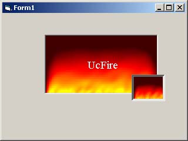



## Fire \(nice animated fire in UserControl \!\)

### Description

this is a UserControl drawing an hot animated Fire.

you can use it easily by it's properties!
 
### More Info
 
you can set DispAtDesign to true if you want control be active in design mode. but if you do this, window will updates continuesly and has some bad effect if you want writing code (and use autocomplete).

             |
---                |---
**Submitted On**   |2001-05-31 03:46:40
**By**             |[Saeed Serpooshan](https://github.com/Planet-Source-Code/PSCIndex/blob/master/ByAuthor/saeed-serpooshan.md)
**Level**          |Intermediate
**User Rating**    |4.2 (42 globes from 10 users)
**Compatibility**  |VB 5\.0, VB 6\.0
**Category**       |[Graphics](https://github.com/Planet-Source-Code/PSCIndex/blob/master/ByCategory/graphics__1-46.md)
**World**          |[Visual Basic](https://github.com/Planet-Source-Code/PSCIndex/blob/master/ByWorld/visual-basic.md)
**Archive File**   |[Fire \(nice203345312001\.zip](https://github.com/Planet-Source-Code/saeed-serpooshan-fire-nice-animated-fire-in-usercontrol__1-23605/archive/master.zip)

